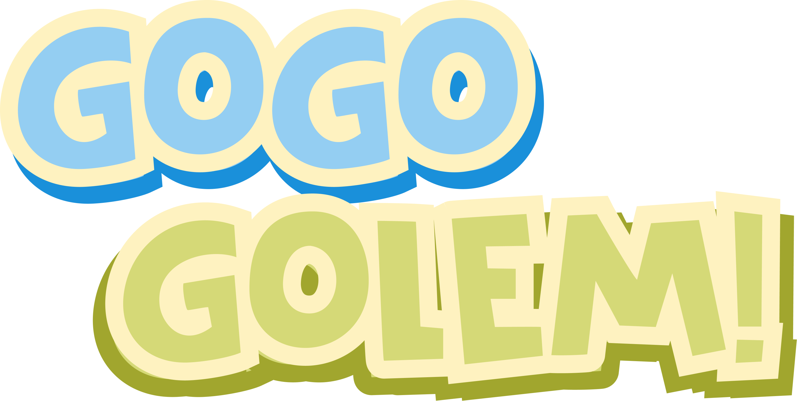
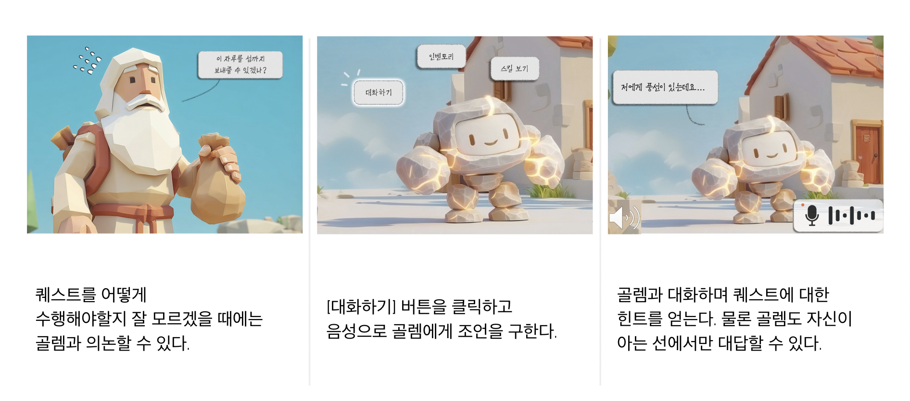
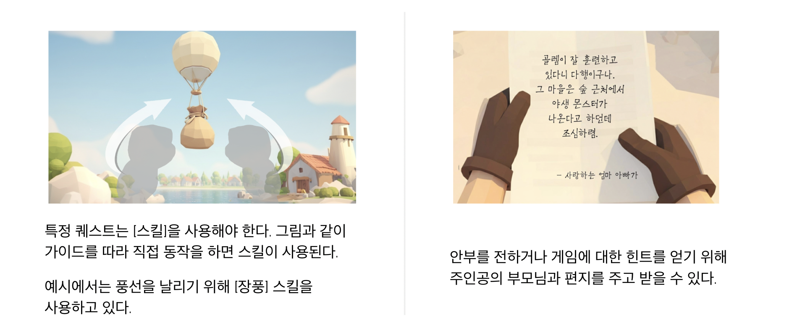

<p align="center">
  
</p>

# GoGo Golem! 🧌

NPC와 다양한 방식으로 상호작용하여 함께 성장하며 스토리를 이어가는 어드벤처 게임

## 스토리

**가문의 전통을 깨부수는, 작고 어리숙한 '걸작'을 만드세요!**

이 게임은 **아기자기하고 따스한 판타지 세계**를 무대로, 대대로 마을을 수호하는 **완벽한 골렘**을 만들어야 하는 장인 가문의 후계자인 **당신**과 그 손에서 태어난 **예상 밖의 골렘**이 함께 성장하는 스토리 어드벤처입니다.

당신의 골렘은 마을을 지켜온 **우직하고 거대한 수호자**의 모습과는 너무나 다릅니다. 제작 중 실수로 탄생한 이 **작고 호기심 많은 친구**는 명령에 무조건 복종하는 대신, 세상 모든 일에 '왜?'를 묻습니다.

당신은 이 모자란 듯 특별한 골렘을 제대로 가르치기 위해 비밀스러운 여행을 떠납니다. **음성, 손짓, 제스처** 등 다양한 방식으로 골렘과 교감하고, 세상의 가치를 가르치며 둘만의 **각별한 유대**를 쌓게 됩니다.

**과연 당신의 '실수'는 마을의 영웅이 될 수 있을까요?**
<br />
<br />

<p align="center">
  
  
</p>

<br />

## 게임 진행 방식

완벽한 골렘을 만들기 위해 맵을 탐험하고 퀘스트를 수행하며 스토리를 이어갑니다. 음성, 몸짓 등 다양한 상호작용으로 게임 속 세계관에 빠져들어 보세요!
<br />
<br />

<p align="center">
  
</p>
<p align="center">
  
</p>

## 기술 아키텍처
```
.
├── demo/src/
│   ├── ai/
│   │   ├── interaction/
│   │   │   ├── core/                    # 공통 핵심 모듈
│   │   │   │   ├── components/          # LLM 컴포넌트
│   │   │   │   ├── di/                  
│   │   │   │   ├── infra/               # LiteLLM 라우팅
│   │   │   │   └── utils/               
│   │   │   ├── server/                  # FastAPI 서버
│   │   │   │   ├── core/                # WebSocket 세션 관리
│   │   │   │   ├── dto/                 
│   │   │   │   ├── router/              
│   │   │   │   └── app.py
│   │   │   └── speech/                  # 음성 처리 모듈
│   │   │       ├── components/          # STT, TTT 컴포넌트
│   │   │       ├── domain/              # 도메인 로직
│   │   │       ├── prompts/             # 프롬프트
│   │   │       └── main.py
│   │   ├── Dockerfile
│   │   ├── docker-compose.yaml
│   │   └── pyproject.toml
│   │
│   └── unity/GoGoGolemDemo/
│       ├── Assets/
│       │   ├── Scripts/                 # C# 스크립트
│       │   ├── Scenes/                  # Unity 씬
│       │   ├── Prefabs/                 # 프리펩
│       │   ├── MediaPipeUnity/          # MediaPipe 연동
│       │   ├── EverydayMotionPackFree/  # 애니메이션 에셋
│       │   ├── Fonts/                   # 폰트
│       │   ├── Settings/                # 렌더링 설정
│       │   └── Sprites/                 # 스프라이트
│       └── ProjectSettings/             # Unity 프로젝트 설정
│
├── docs/                                # 캡스톤 디자인 과목 문서
│   ├── GroundRules.MD
│   ├── Ideation.MD
│   └── Project-Scenario.MD
│
└── README.md
```


## 키워드
`#스토리` `#멀티모달AI` `#성장` `#어드벤처` `#귀여움`
