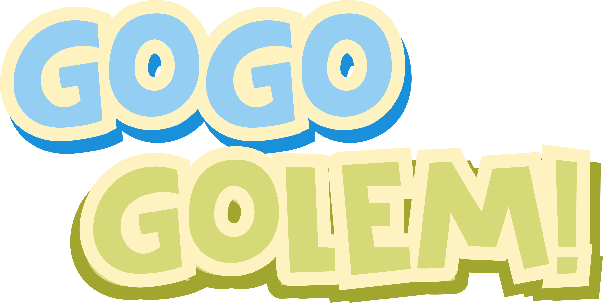
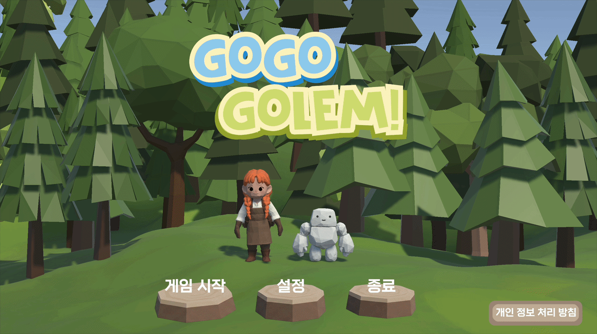

<p align="center">
  
</p>

<h1 align="center">GoGo Golem!</h1>

<p align="center">
  <b>음성 · 손동작 · 편지</b>로 골렘과 교감하며 정착지를 일구는 멀티모달 3D 스토리 어드벤처
</p>

<p align="center">
  
  
  
  
  
</p>

<p align="center">
  <b>장르</b> 3D 판타지 성장 어드벤처 &nbsp;·&nbsp; <b>플랫폼</b> Windows
</p>


## 스토리

**가문의 전통을 깨부수는, 작고 어리숙한 '걸작'을 만드세요!**

<p align="center">
  
</p>

대대로 마을을 수호하는 **완벽한 골렘**을 만들어야 하는 장인 가문의 후계자, 그리고 그 손에서 태어난 **예상 밖의 골렘**이 함께 성장하는 판타지 어드벤처입니다.

제작 중 실수로 탄생한 이 **작고 호기심 많은 친구**는 주인공과 **영혼이 연결**되어 버립니다. 사람과 골렘의 영혼 연결은 마을의 금기. 당신은 이 모자란 듯 특별한 골렘과 함께 여정을 떠나 **음성, 손짓, 편지**로 교감하며, 낯선 정착지의 주민들을 돕고 진정한 수호자로 거듭납니다.

**과연 당신의 '실수'는 마을의 영웅이 될 수 있을까요?**


## 게임 정보

<p align="center">
  
</p>
<p align="center">
  
</p>
<p align="center">
  
</p>
<p align="center">
  
</p>

---

### 당신의 목소리와 몸짓으로 완성되는, 새로운 형태의 어드벤처입니다.

마이크와 웹캠을 통해, 골렘과 직접 대화하고 교감하세요.
말을 걸고, 손을 뻗고, 신호를 보내며 — 컨트롤러 너머의 행동이 그대로 게임 속 세계에 이어집니다.

**작고 어리숙한 골렘과 함께, 정착지의 삶 속으로 들어가세요**

말을 잘 못하는 골렘, 하지만 언제나 당신을 따라오는 존재. 완벽하지 않기에 더 특별한 이 친구와 함께, 하루하루를 만들어갑니다.

**마을 주민들의 의뢰를 통해 세상과 연결되세요.**

길 잃은 물건을 찾아달라는 할아버지, 메말라있는 마을 우물, 작은 부탁에서 시작된 여정은 점점 더 깊어지고, 당신은 이곳의 일부가 되어갑니다.


**당신만의 방식으로 골렘과 호흡을 맞추세요.**

같은 상황에서도, 어떻게 말하고 어떻게 움직이느냐에 따라 골렘의 반응과 행동은 달라집니다. 정답은 없습니다. 당신과 골렘이 만들어가는 방식이 곧 플레이 스타일이 됩니다.

**몸짓으로 완성되는 협동 마법을 익히세요.**

스킬을 발동시키기 위해 손동작을 하세요. 골렘은 당신의 움직임을 따라하며 힘을 끌어냅니다. 처음엔 서툴지만, 점점 더 자연스럽고 강력한 호흡으로 이어집니다.

**편지를 통해, 또 다른 이야기를 이어가세요.**

하루가 끝나면 부모님께 편지를 씁니다. 오늘 겪은 일, 골렘과의 순간들, 그리고 아직 풀리지 않은 질문들. 다음 날 도착하는 답장은 당신이 보지 못했던 시선과 새로운 힌트를 전해줍니다.

**당신의 선택이 정착지를 변화시킵니다.**

의뢰를 하나씩 해결할 때마다, 비어 있던 공간에 새로운 변화가 생깁니다. 사람들이 모이고, 이야기가 쌓이고, 낯설었던 곳이 점점 당신의 마을이 되어갑니다.

**따뜻하면서도 어딘가 세계를 탐험하세요.**

조용한 숲길, 낯선 정착지 — 모든 공간에는 아직 밝혀지지 않은 이야기들이 남아 있습니다. 당신과 골렘은 그 조각들을 하나씩 이어가게 됩니다.

**완벽하지 않은 존재가, 진짜 수호자가 되어가는 이야기.**

처음부터 완벽할 필요는 없습니다. 실수로 태어난 골렘, 그리고 아직 미숙한 당신. 그 둘이 함께 만들어가는 여정이 이 세계를 지키는 힘이 됩니다.

---

## 기술 스택

| Layer       | Stack |
|-------------|-------|
| **Client**  | Unity 6000.0.62f1 · C# · New Input System · Animation Rigging · Yarn Spinner · MediaPipe · WebCamTexture |
| **Server**  | Python 3.11 · FastAPI · WebSocket · LiteLLM (ModelRouter 기반 Fallback) |
| **AI**      | OpenAI Realtime API · LLM 편지 응답 생성 |
| **DB**      | Firebase Firestore (편지) · Unity PlayerPrefs / JSON (로컬 세이브) |
| **Infra**   | Docker · docker-compose |

### 아키텍처 특징

* **Unity**
  `Managers` 싱글톤과 **ScriptableObject 기반 이벤트 버스**를 활용해 시스템 간 결합도를 낮췄습니다.
  또한 **MVP(Presenter–View) 패턴**을 적용해 UI 로직을 명확히 분리했습니다.

* **AI 서버**
  **Clean Architecture + DDD**를 기반으로 Server / Application / Domain / Infra의 4계층 구조로 설계했습니다.
  Port 인터페이스를 통해 도메인 레이어가 특정 구현 기술에 의존하지 않도록 구성했습니다.

* **AIBridge**
  HTTP(`AIHttpClient`)와 WebSocket(`RealtimeWebSocketClient`)을 분리하여
  통신 방식에 따라 독립적인 클라이언트 구조를 설계했습니다.

## 실행 환경

| 요구사항 | 내용 |
|---------|------|
| OS      | Windows |
| 필수 장치 | 마이크 · 웹캠 |

## 프로젝트 구조

```
.
├── GoGoGolem/src/
│   ├── ai/                              # AI 서버 (FastAPI + WebSocket)
│   │   ├── interaction/
│   │   │   ├── core/                    # 공통 인프라 (LiteLLM Router, Firebase)
│   │   │   ├── server/                  # FastAPI Router / WebSocket / DTO
│   │   │   ├── speech/                  # 음성 도메인 (Realtime / VAD)
│   │   │   └── text/                    # 편지 도메인 (LLM 응답 생성)
│   │   ├── Dockerfile
│   │   ├── docker-compose.yaml
│   │   └── pyproject.toml
│   │
│   └── unity/GoGoGolem/
│       ├── Assets/
│       │   ├── Scripts/                 # C# (Managers, Quest, Dialogue, AIBridge, …)
│       │   ├── Scenes/                  # 시작 · 프롤로그 · 숲 · 제스처 · 정착지 · 숙소
│       │   ├── Prefabs/
│       │   ├── MediaPipeUnity/          # MediaPipe Unity Plugin
│       │   ├── Fonts/ · Sprites/ · Settings/
│       │
│       └── ProjectSettings/
│
├── docs/
├── assets/
└── README.md
```


## 팀 트리오링고

이화여자대학교 컴퓨터공학과 캡스톤 디자인 프로젝트

- **강한나** · **박세은** · **최은별**


## 키워드

`#멀티모달AI` `#정서적교감` `#어드벤처` `#로우폴리감성` `#힐링게임`
