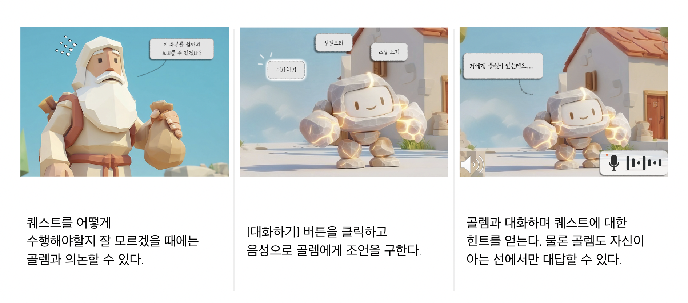
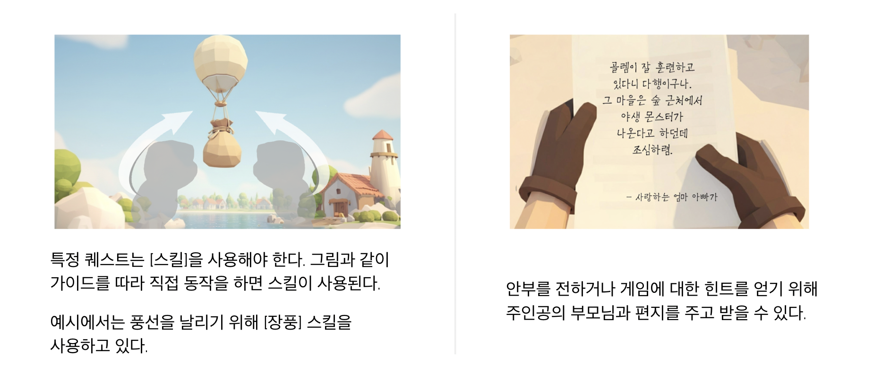

<p align="center">
  
</p>

<h1 align="center">GoGo Golem! 🧌</h1>

<p align="center">
  <b>음성 · 손동작 · 편지</b>로 골렘과 교감하며 정착지를 일구는 멀티모달 3D 스토리 어드벤처
</p>

<p align="center">
  
  
  
  
  
</p>

<p align="center">
  <b>장르</b> 3D 판타지 성장 어드벤처 &nbsp;·&nbsp; <b>타겟</b> 만 6~12세 아동 &nbsp;·&nbsp; <b>플랫폼</b> Windows Desktop
</p>

<br />

## 📖 스토리

**가문의 전통을 깨부수는, 작고 어리숙한 '걸작'을 만드세요!**

<p align="center">
  
</p>

대대로 마을을 수호하는 **완벽한 골렘**을 만들어야 하는 장인 가문의 후계자, 그리고 그 손에서 태어난 **예상 밖의 골렘**이 함께 성장하는 판타지 어드벤처입니다.

제작 중 실수로 탄생한 이 **작고 호기심 많은 친구**는 주인공과 **영혼이 연결**되어 버립니다. 사람과 골렘의 영혼 연결은 마을의 금기. 당신은 이 모자란 듯 특별한 골렘과 함께 비밀스러운 여정을 떠나 **음성, 손짓, 편지**로 교감하며, 낯선 정착지의 주민들을 돕고 진정한 수호자로 거듭납니다.

**과연 당신의 '실수'는 마을의 영웅이 될 수 있을까요?**

<br />

<br />

## 🎮 게임 진행 방식

완벽한 골렘을 만들기 위해 맵을 탐험하고 퀘스트를 수행하며 스토리를 이어갑니다. 음성, 몸짓 등 다양한 상호작용으로 게임 속 세계관에 빠져들어 보세요!

<p align="center">
  
</p>
<p align="center">
  
</p>

<br />

## 핵심 기능

### 🎙️ 음성 대화 — 골렘과 실시간으로 의논하기
- **OpenAI Realtime API + WebSocket** 기반 실시간 스트리밍 대화
- 서버 VAD로 발화 경계 자동 감지, 응답은 **텍스트 델타 스트리밍**으로 즉시 출력
- 세션 시작 시 퀘스트 컨텍스트를 전달해 골렘이 현재 상황을 인식한 채 대화
- 프롬프트 엔지니어링으로 **정답을 직접 주지 않고 탐색을 유도**하는 대화 방식 구현

### ✋ 모션 인식 — 팔·손동작으로 마법 발동
- **MediaPipe**(`MediaPipeUnityPlugin`)로 Hand Landmarker(양손 42점) + Pose Landmarker(33점) 동시 감지
- **Strategy 패턴** 기반 5가지 조건 복합 판정으로 바람 제스처 인식 — flickering 방지 유예 카운터 포함
- Animation Rigging IK + Jitter 필터로 **골렘 아바타의 팔·손가락을 실시간 미러링**
- 3초 홀드 판정 + 원형 진행 바 피드백 + 22개 관절 발광 연출
- 첫 사용 시 Timeline 기반 튜토리얼 자동 재생

### ✉️ 편지 시스템 — 부모님과 비동기 소통
- 하루 일과를 마치고 숙소에서 **텍스트로 편지 작성** → 다음 날 아침 답장 수령
- **FastAPI + LLM**으로 답장을 백그라운드 비동기 생성, **Firebase Firestore**에 저장
- 답장에는 플레이어의 편지 내용을 반영한 개인화된 힌트가 자연스럽게 녹아듦

<br />

## 🗺️ 게임 흐름

```
게임 시작 → 프롤로그(마을)       세계관 영상 · 주인공/골렘 이름 입력
         → 튜토리얼(숲)         첫 퀘스트로 이동/대화/제스처 학습
         → 바람 제스처 씬       웹캠 앞에서 실제 동작으로 마법 발동
         → 정착지               주민 의뢰 해결 · 마을 발전
         → 숙소                 편지 작성 후 취침 → 다음 날 반복
         → 엔딩(마을 귀향)      축제에서 골렘이 새로운 수호자로 인정받음
```

<br />

## 🛠️ 기술 스택

| Layer       | Stack |
|-------------|-------|
| **Client**  | Unity 6000.0.62f1 · C# · New Input System · Animation Rigging · Yarn Spinner · MediaPipe · WebCamTexture |
| **Server**  | Python 3.11 · FastAPI · WebSocket · LiteLLM (ModelRouter 기반 Fallback) |
| **AI**      | OpenAI Realtime API · LLM 편지 응답 생성 |
| **DB**      | Firebase Firestore (편지) · Unity PlayerPrefs / JSON (로컬 세이브) |
| **Infra**   | Docker · docker-compose |

### 아키텍처 특징
- **Unity**: `Managers` 싱글톤 + **ScriptableObject 이벤트 버스**로 시스템 간 느슨한 결합. MVP(Presenter-View) 패턴으로 UI 분리.
- **AI 서버**: **Clean Architecture + DDD** — Server / Application / Domain / Infra 4계층. Port 인터페이스로 도메인이 구현 기술에 독립.
- **AIBridge**: HTTP(`AIHttpClient`) · WebSocket(`RealtimeWebSocketClient`) 채널별로 통신 클라이언트를 분리.

<br />

## 🖥️ 실행 환경

| 요구사항 | 내용 |
|---------|------|
| OS      | Windows |
| 필수 장치 | 🎤 마이크 · 📷 웹캠 (상반신과 손이 프레임에 포함, 단순한 배경, 충분한 조명 권장) |
| 네트워크 | 실시간 음성 처리를 위한 저지연 인터넷 연결 |

<br />

## 📁 프로젝트 구조

```
.
├── GoGoGolem/src/
│   ├── ai/                              # AI 서버 (FastAPI + WebSocket)
│   │   ├── interaction/
│   │   │   ├── core/                    # 공통 인프라 (LiteLLM Router, Firebase)
│   │   │   ├── server/                  # FastAPI Router / WebSocket / DTO
│   │   │   ├── speech/                  # 음성 도메인 (Realtime / VAD)
│   │   │   └── text/                    # 편지 도메인 (LLM 응답 생성)
│   │   ├── Dockerfile
│   │   ├── docker-compose.yaml
│   │   └── pyproject.toml
│   │
│   └── unity/GoGoGolem/
│       ├── Assets/
│       │   ├── Scripts/                 # C# (Managers, Quest, Dialogue, AIBridge, …)
│       │   ├── Scenes/                  # 시작 · 프롤로그 · 숲 · 제스처 · 정착지 · 숙소
│       │   ├── Prefabs/
│       │   ├── MediaPipeUnity/          # MediaPipe Unity Plugin
│       │   ├── Fonts/ · Sprites/ · Settings/
│       │
│       └── ProjectSettings/
│
├── docs/                                # 캡스톤 문서 (기획 · 시나리오 · 보고서)
├── assets/                              # 로고 · 스크린샷
└── README.md
```

<br />

## 👥 팀 트리오링고

이화여자대학교 컴퓨터공학과 캡스톤 디자인 프로젝트

- **강한나** · **박세은** · **최은별**

<br />

## 🏷️ 키워드

`#멀티모달AI` `#정서적교감` `#어드벤처` `#로우폴리감성` `#아동발달` `#힐링게임`
